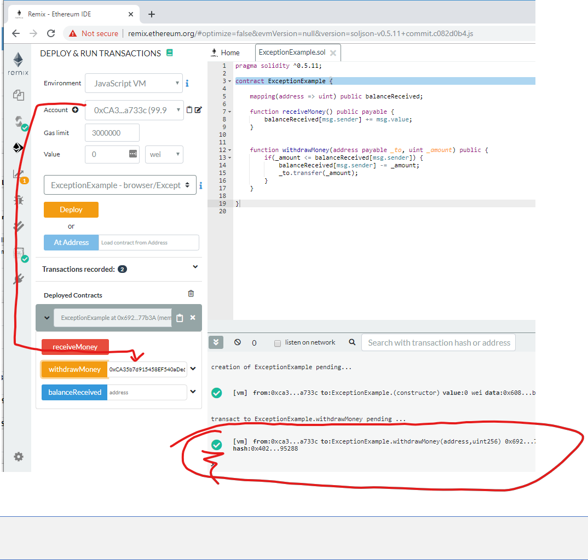
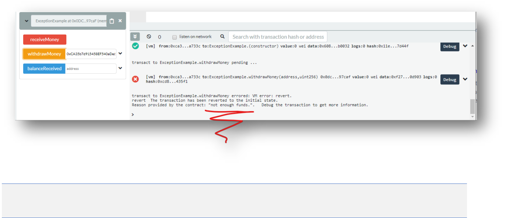
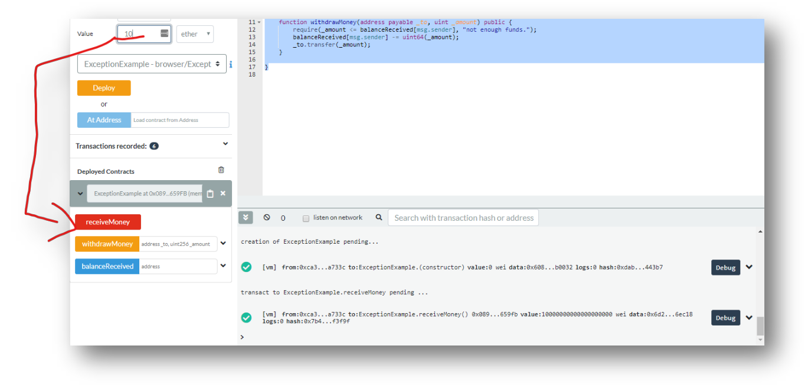
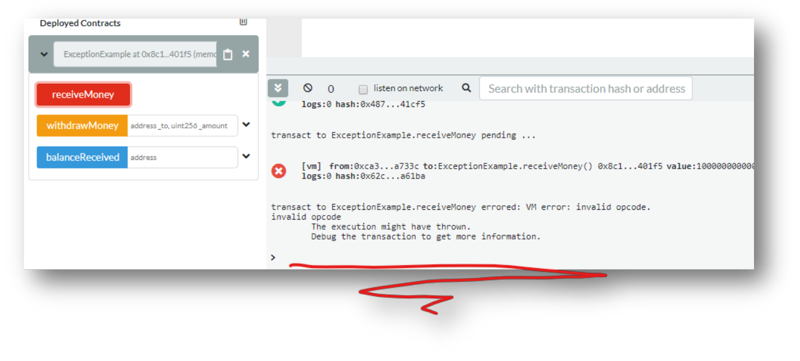

# Error Handling in Solidity

Prerequisites
1. Chrome or Firefox browser.
2. An Internet connection
3. Open Remix with the following Smart Contract:

```js
// SPDX-License-Identifier: MIT

pragma solidity ^0.7.1;

contract ExceptionExample {
    mapping(address => uint) public balanceReceived;

    function receiveMoney() public payable {
        balanceReceived[msg.sender] += msg.value;
    }

    function withdrawMoney(address payable _to, uint _amount) public {
        if(_amount &lt;= balanceReceived[msg.sender]) {
        balanceReceived[msg.sender] -= _amount;
        _to.transfer(_amount);
        }
    }
}
```

## Step by Step Instruction

### Deploy the Smart Contract in the JavaScript VM

- Open the **Deploy and Run Transactions** view in Remix with the smart contract

### Try to withdraw more than you have

- At the beginning you have 0 Ether. When we try to withdraw some then simply nothing happens.



### Replace the if with a Require

```js
// SPDX-License-Identifier: MIT

pragma solidity ^0.7.1;

contract ExceptionExample {
    mapping(address => uint) public balanceReceived;

    function receiveMoney() public payable {
        balanceReceived[msg.sender] += msg.value;
    }

    function withdrawMoney(address payable _to, uint _amount) public {
        require(_amount &lt;= balanceReceived[msg.sender], &quot;not enough funds.&quot;);
        balanceReceived[msg.sender] -= _amount;
        _to.transfer(_amount);
    }
}
```

- And try to withdraw again. It should throw an error!



### Add an Assert

- Imagine your balance is not of the type `uint256`, but of the type `uint64` – to save some storage costs.
- If you send two times 10 Ether to your smart contract it will automatically roll over to 0:

```js
// SPDX-License-Identifier: MIT

pragma solidity ^0.7.1;

contract ExceptionExample {
    
    mapping(address => uint64) public balanceReceived;

    function receiveMoney() public payable {
        balanceReceived[msg.sender] += uint64(msg.value);
    }

    function withdrawMoney(address payable _to, uint _amount) public {
        require(_amount <= balanceReceived[msg.sender], "not enough funds.");
        balanceReceived[msg.sender] -= uint64(_amount);
        _to.transfer(_amount);
    }
}
```




- It is lower, because the uint64 rolls over to 0 after reaching the maximum value of 18446744073709551616 – that’s around 18.44 Ether
- Here we could use asserts to make sure we don’t roll over – in both directions! 
- When withdrawals happen, we don’t suddenly have more balance available than before and when deposits happen that the balance after depositing is really higher than before.

### Add an assert, to make sure the balance can only grow larger

```js
// SPDX-License-Identifier: MIT

pragma solidity ^0.7.1;

contract ExceptionExample {
    mapping(address => uint64) public balanceReceived;

    function receiveMoney() public payable {
        assert(balanceReceived[msg.sender] + uint64(msg.value) >= balanceRecei
        ved[msg.sender]);
        balanceReceived[msg.sender] += uint64(msg.value);
    }

    function withdrawMoney(address payable _to, uint _amount) public {
        require(_amount <= balanceReceived[msg.sender], "not enough funds.");
        assert(balanceReceived[msg.sender] >= balanceReceived[msg.sender] - _amount);
        balanceReceived[msg.sender] -= uint64(_amount);
        _to.transfer(_amount);
    }
}
```

### test again

- Send again 2 times 10 Ether to the smart contract. It will end in an error.



#### Congratulations!

